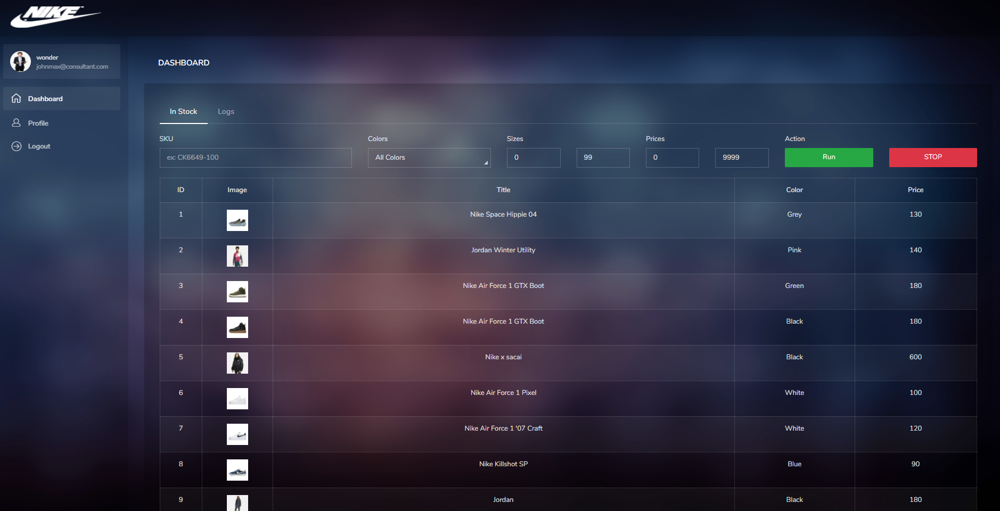

# NikeBot - Node.js
## User interface and bot process management
Based on node.js application to make orders using platform interface with search products
with mongodb database
## -- install
```
npm install
```
## -- run 
```
node server.js
```
## Configuration
Configuration file is located in config/index.js
mongodb database configs and initial admin information, running port and base url

## running
- login with nike account

[](#)

- running process with filter information 

[](#)
